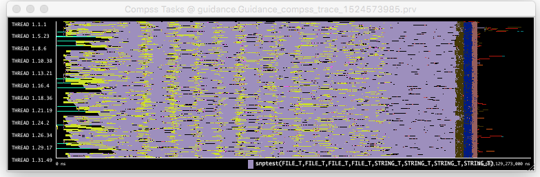
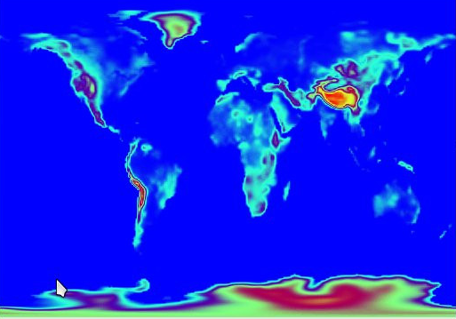
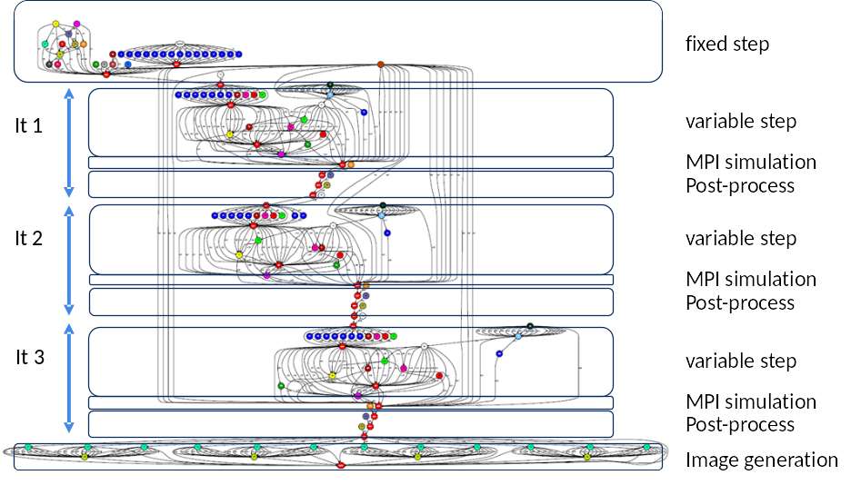
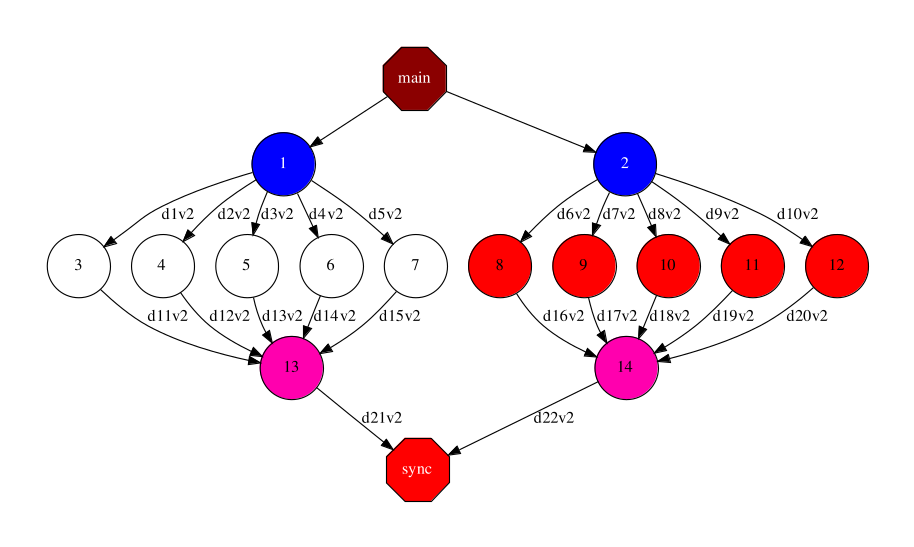
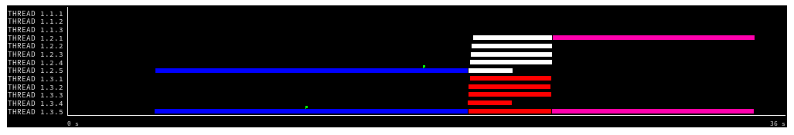
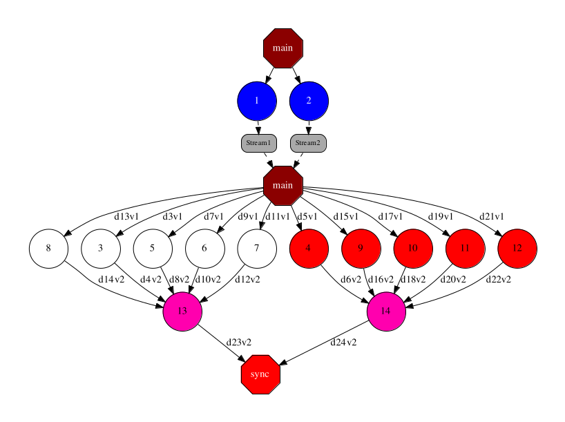
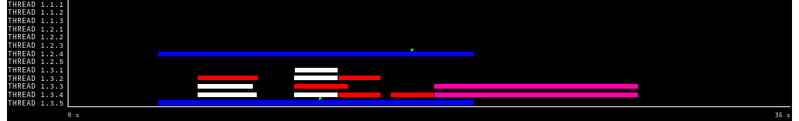
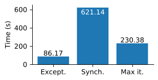

===========
. Use cases
===========

Example use of constraints: Guidance
------------------------------------

A sample application where constraints are useful is Guidance, a tool for
Genome-Wide Association Studies (GWAS) developed by the BSC Life Sciences
department with other collaborators.
This workflow composes multiple external binaries and scripts

A lot of its tasks, although sequential,  have different high memory
requirements. With individual memory constraints per each task type, the
runtime can decide how many tasks can run concurrently in a given node, without
exceeding the node memory capacity.

.. code-block:: python

    @constraint(memory_size=6.0)
    @task(gmapFile=FILE_IN, knownHapFile=FILE_IN, ...)
    def imputeWithImpute(gmapFile, knownHapFile, theChromo, ...):
        # ...

NMMB-Monarch: Weather and dust forecast
---------------------------------------

An example of usage of this idea is the application Multiscale Online
Nonhydrostatic Atmosphere Chemistry model (NMMB-Monarch) that aims at providing
short to medium range weather and gas-phase chemistry forecasts from regional
to global scales  that performs weather and dust forecast.
NMMB-Monarch is used as an operational tool to provide information services
at BSC.

The application combines multiple sequential scripts and MPI simulations.
PyCOMPSs enables the smooth orchestration of all them as a single workflow.

Use case: MPI simulations, analytics and streaming
--------------------------------------------------

In this section, we illustrate a sample case where multiple MPI simulations generating data at given steps to be processed by some analytics.

For instance, the graph below shows the case of a pure task-based application that launches a given number of MPI simulations (blue nodes). Each simulation produces output files at different time steps of the simulation (i.e., an output file every iteration of the simulation). The results of these simulations are processed separately (white and red nodes)  and merged to a single resulting output per simulation (pink nodes). 

With a regular task-based execution model, the tasks processing the results will need to wait till the end of the simulations. The figure below shows a tracefile of the execution of  a sample application with such behavior. Each line represents a core executing the different tasks. The simulation tasks, although could be run with multiple cores/nodes, in this trace are represented as single core tasks. 

In the graph below, we represent the hybrid task-based/data-flow workflow, where the simulation tasks write into a stream. The data is then read by the main program and forward to the process tasks. Another alternative would have been to connect directly the process tasks with the stream, reading directly the results of the simulations. 

The trace below show the improvement obtained by the use of streams, since process tasks do not need to wait until the end of the simulation tasks to start processing the results. This enable the overlapping of the two type of tasks. 

Evaluation of task exception mechanism with the dislib
------------------------------------------------------

The task exception mechanism has been evaluated with the Grid search model
selection algorithm executed with the Cascade-SVM estimator.

Cascade-SVM performs a convergence check at the end of each iteration. The
convergence check requires a data synchronization that prevents concurrent
execution of multiple estimators.

The convergence check has been encapsulated into a task that throws an exception
if the convergence criterium is met. The main program cancels the remaining
iterations when the exception is captured.

This new implementation (Except) shows better performance results than previous versions,
either with convergence check (Synch) or without convergence check running a
maximum number of iterations (Max it).

