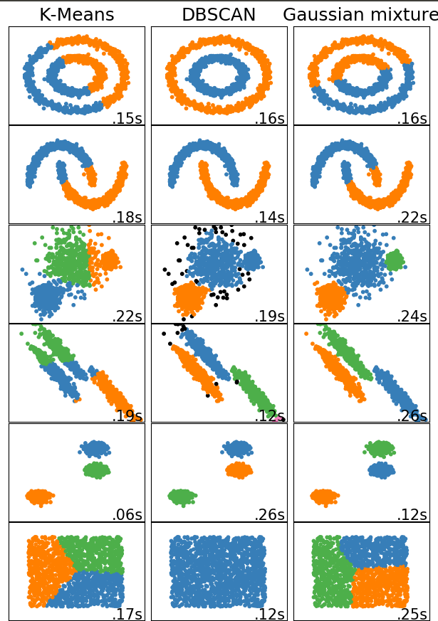
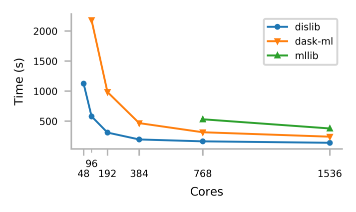
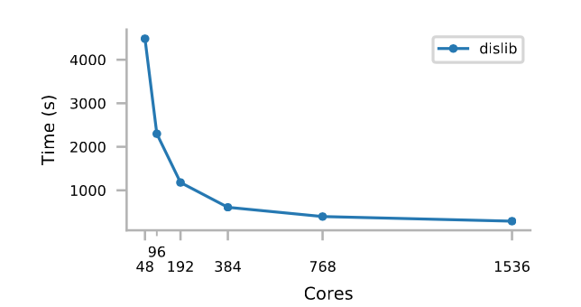

========
· Dislib
========

Dislib is a distributed machine learning library parallelized with PyCOMPSs that
enables large-scale data analytics on HPC infrastructures.
Inspired by scikit-learn, dislib provides an estimator-based interface that
improves productivity by making algorithms easy to use and interchangeable.
This interface also makes programming with dislib very easy to scientists
already familiar with scikit-learn. Dislib also provides a distributed data
structure that can be operated as a regular Python object. The combination of
this data structure and the estimator-based interface makes dislib a
distributed version of scikit-learn, where communications, data transfers, and
parallelism are automatically handled behind the scene.

Comparison with MLlib and Dask-ML 
=================================

Dislib performance has been compared with MLlib and Dask-ML. The performance of
dislib is not only better but also, for very large sizes, dislib can obtain
results while MLlib and dask fail to finish the execution. 

The figure below shows the execution time of a K-means clustering of 500 million samples of 100 features, and 500 clusters. The execution is done in the MareNostrum supercomputer which accounts with nodes of 48 cores, using from 1 to 32 nodes. Those core counts for which there is no information indicate that we have not been able to run that case due to memory issues.  

The figure below shows the execution time of 2 billion samples of 100 features, and 500 clusters. We were not able to run this sample case neither with Dask-ML, nor with MLlib.  

