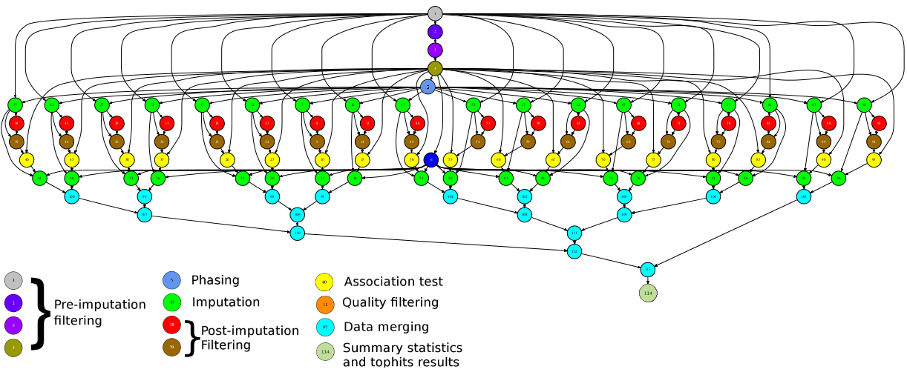
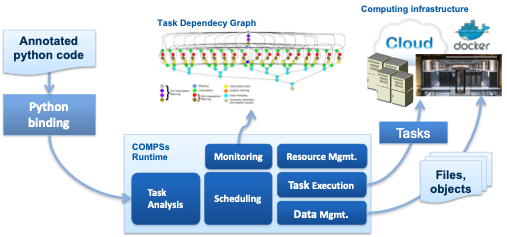
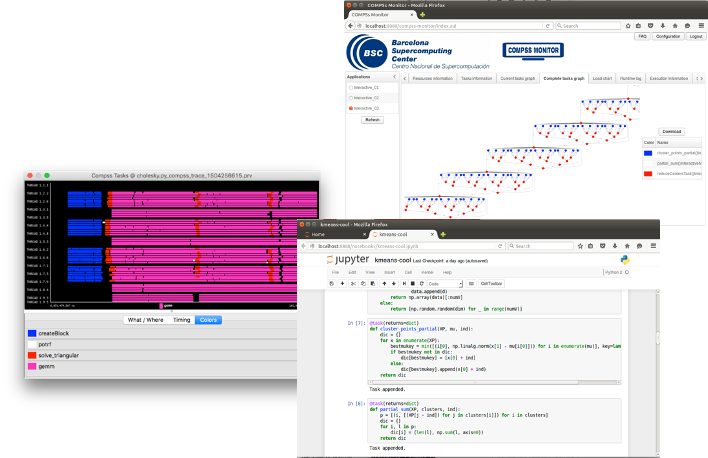

==================================
· PyCOMPSs overview
==================================

PyCOMPSs is a parallel task-based programming model for distributed computing
platforms. Based on a sequential interface, at execution time the COMPSs runtime
is able to exploit the inherent parallelism of applications at task level.

A PyCOMPSs application is composed of tasks, methods annotated with decorators.
The decorator identifies the tasks and includes the directionality of their
parameters. The runtime builds at execution time a task-graph taking into
account the task data-dependencies, and schedules and executes the tasks in
the distributed infrastructure, taking also care of the required data transfers.

PyCOMPSs/COMPSs applications are executed in distributed mode following the
master-worker paradigm. The computational infrastructure is described in an XML
file.

The application starts in the master node and tasks are offloaded to worker
nodes. All data scheduling decisions and data transfers are performed by the
runtime.

With regard to the execution environment, COMPSs runtime supports the execution of
applications in large clusters, clouds and federated clouds, and container-managed infrastructures (Docker and Singularity). The runtime supports different
features, such as elasticity (both in clouds and slurm-managed clusters),
failure management at task-level and tasks' exception management. 

PyCOMPSs/COMPSs is not only the programming model and runtime but comes with a set of tools that provides the user with a full environment. The runtime is instrumented with the `Extrae <https://tools.bsc.es/extrae>`__ library (also from BSC) and post-mortem tracefiles of the applications can be generated using an execution flag. These traces can be visualized with the `Paraver <https://tools.bsc.es/paraver>`__ browser, offering a very powerful environment to analyze the performance of the applications. 

Another component is the COMPSs monitor, a web-based application that enables to monitor the execution of the applications. It visualizes the task-graph under execution, the available resources, the workload, etc. 

Jupyter notebooks are also integrated with the COMPSs runtime, enabling to run PyCOMPSs notebooks, both in in-house infrastructures or in Binder servers. 

